# Awesome VLMs

a structured awesome list of VLMs with my notes.

## General surveys

- [ ] ["Exploring the Frontier of Vision-Language Models: A Survey of Current Methodologies and Future Directions"](https://arxiv.org/abs/2404.07214) by Ghosh et al. 2024
  - Vision-Language Understanding
  - Text Generation with Multimodal Input
  - Multimodal Output with Multimodal Input
- [ ]

## Model zoo - Vision-Language Understanding

- [x] [CLIP](https://arxiv.org/abs/2103.00020)
- [x] [SigLIP](https://arxiv.org/abs/2303.15343) - sigmoid loss without global normalization from Softmax
- [x] [AlphaCLIP](https://arxiv.org/abs/2312.03818)
  - motivation: focusing on the regions of interest matters for fine-grained understanding
  - contribution: 
    - datasets with more fine-grained region-text pairs
    - image encoder with an additional alpha channel
    - 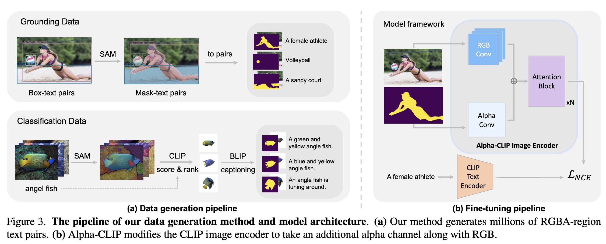

- [x] [GLIP](https://arxiv.org/abs/2112.03857)
  - motivation: object-level (instead of image-level from CLIP) visual representations are needed
  - contribution:
    - reframe object detection as phrase grounding
    - replace the classification loss in object detection with alignment loss
      - alignment score: 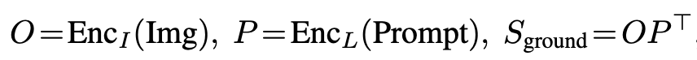
    - 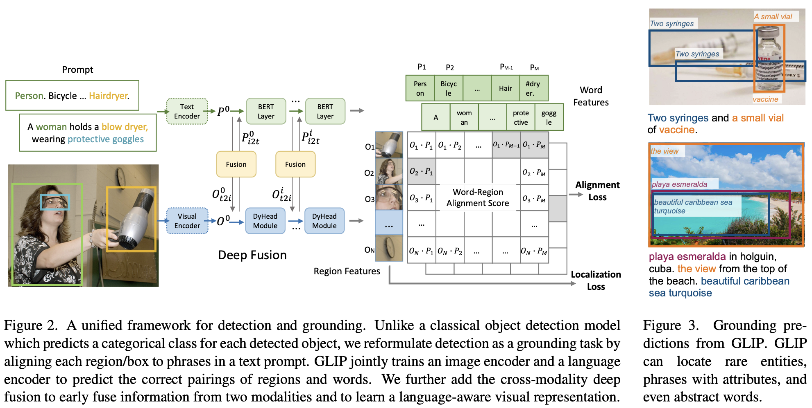
    - deep fusion: 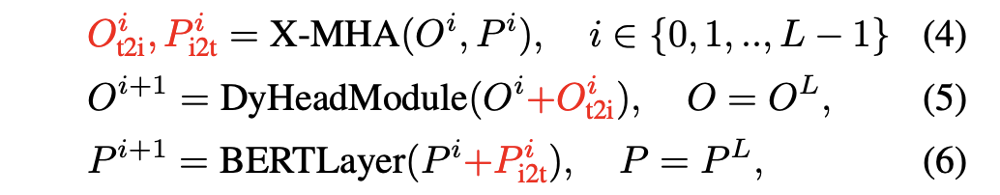

- [x] [ImageBind](https://arxiv.org/abs/2305.05665)
  - motivation: 
    - embeddings are usually limited to the pairs of modalities used for training
    - "just aligning each modality’s embedding to image embeddings leads to an emergent alignment across all of the modalities"
  - contribution:
    - from natural alignment to emergent alignment across images, videos, text, audio, depth, thermal, and IMU
    - 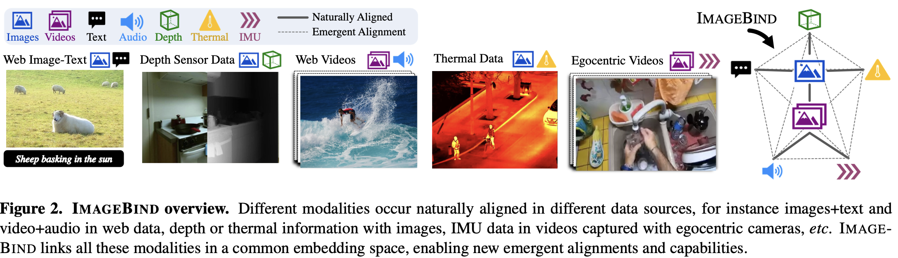
- [x] [VideoCLIP](https://arxiv.org/abs/2109.14084)
  - motivation: granularity about **sequence length** and **semantics** (apple/banana v.s. apple/car) can be hard
  - contribution:
    - for positive pairs: use video and text clips that are **loosely temporarily overlapping** instead of enforcing strict boundaries
      - underlying rationale: strict temporal alignment ≠ semantic alignment!
    - for negative pairs: retrieve a cluster of videos that are similar to each other
      - underlying rationable: "mining clips from other videos can provide much more challenging negatives"
    - 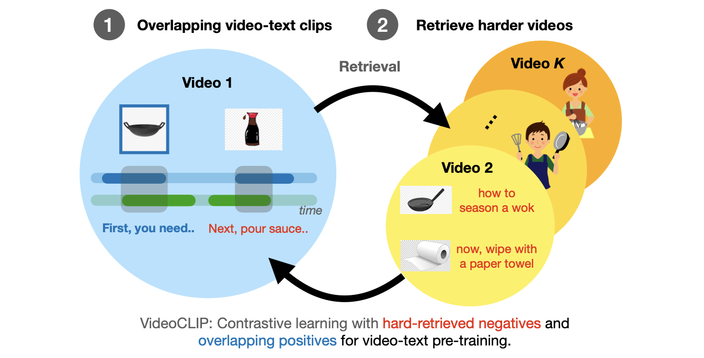

- [x] [FLIP](https://arxiv.org/abs/2212.00794)
  - motivation: efficiency speedup during contrastive pretraining
  - contribution: simply mask many image tokens
    - 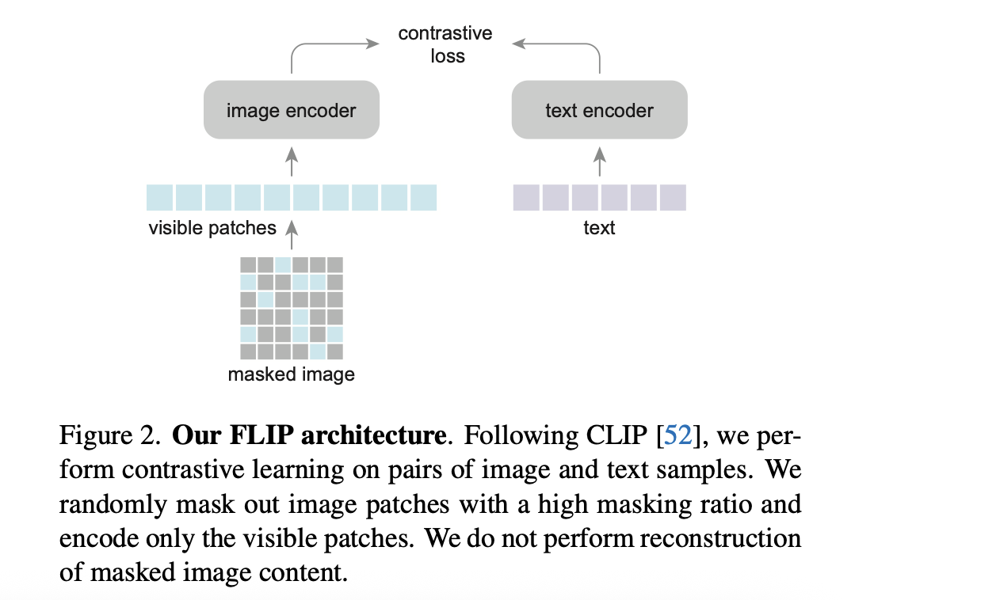

## Model zoo - Text generation with Multimodal Input

- [x] [LLaVA](https://arxiv.org/abs/2304.08485)
- [x] [Flamingo](https://arxiv.org/abs/2204.14198)
  - contribution:
    - cross-attention layers are interleaved between the pretrained LM layers
  - 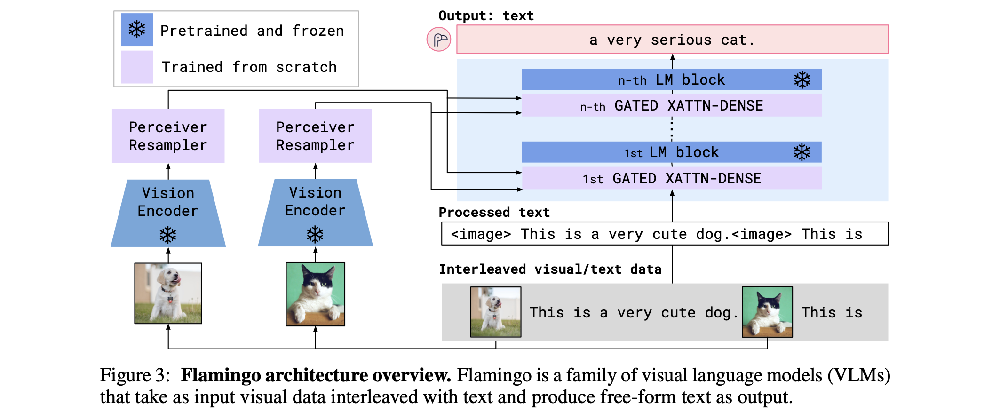
  - 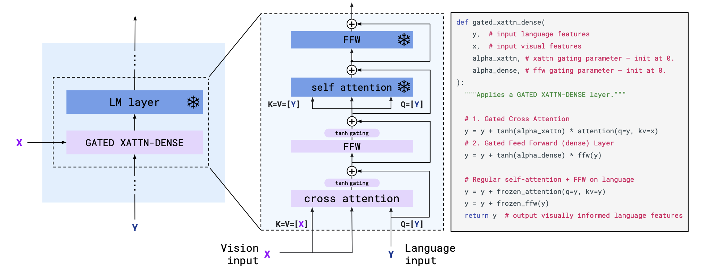
- [x] [VLMo](https://arxiv.org/abs/2111.02358)
  - motivation: take advantage of both a dual encoder (effective for retrieval tasks) and a fusion encoder (superior on VL tasks)
  - contribution:
    - three stages pretraining: 
    - joint pretraining on three tasks: 
      - image-text contrast
      - image-text matching
      - masked LM pretraining
    - 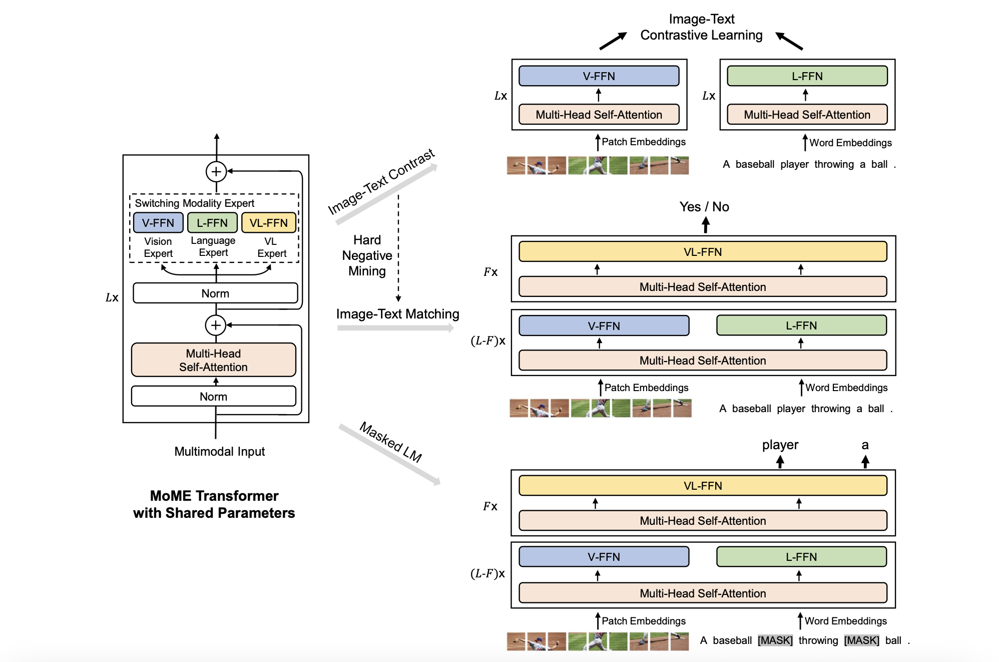
- [x] [BLIP](https://arxiv.org/abs/2201.12086)
  - motivation: generation models (encoder-decoder) and retrieval models (encoder-only) **ain't unified**
  - contribution: 
    - propose multimodal mixture of encoder-decoder (MED) with three objectives trained jointly
      - Image-Text Contrastive Loss (unimodal encoder track)
      - Image-Text Matching Loss (image-grounded text encoder track)
      - Language Modeling Loss (image-grounded text decoder track)
  - 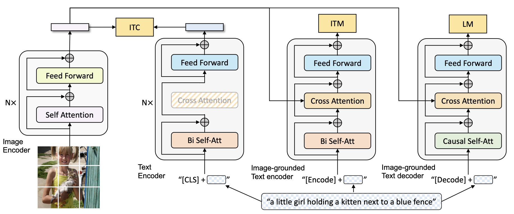
- [x] [BLIP-2](https://arxiv.org/abs/2301.12597)
  - motivation: vision-language alignment is challenging if LLM is frozen
  - contribution:
    - first stage
      - Q-Former consists of **two transformer submodules** that share the same self-attention layers
      - have **queries** (i.e., a set of learnable embeddings) to extract visual representation most relevant to the text
      - 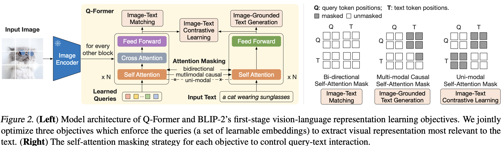
    - second stage
      - FC (i.e., projector) to project query embeddings *Z* into the same dimension as the text embedding of the LLM
      - decoder-based LLMs (e.g. caption) encoder-decoder-based LLMs (soft visual prompts + prefix text)
      - 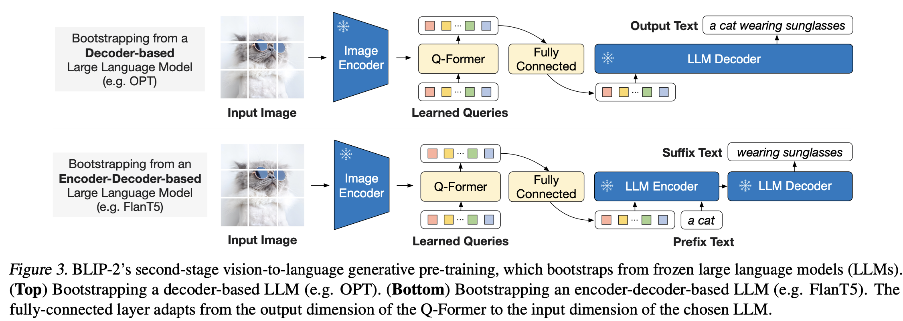

- [x] [InstructBLIP](https://arxiv.org/abs/2305.06500)
  - motivation: existing methods take an **instruction-agnostic** approach when extracting visual features, meaning that a set of **static** visual representations are always being fed into the LLM, regardless of the task
  - contribution:
    - append **instruction tokens** during training (for both Q-Former and LLM)
    - 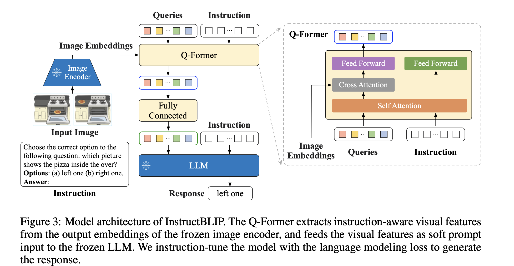

- [x] [KOSMOS-1](https://arxiv.org/abs/2302.14045)

## Future directions

- fine-grained benchmark/evaluation
- training efficiency
- continual learning/unlearning
- more...