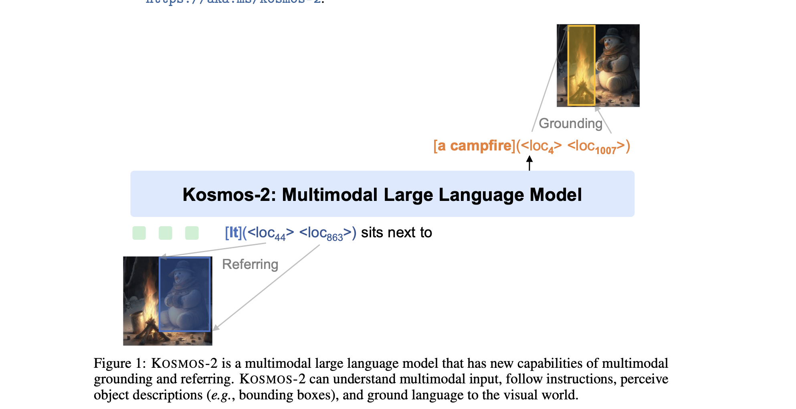
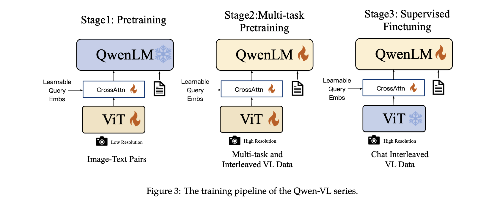

# Text generation with Multimodal Input

- [x] [LLaVA](https://arxiv.org/abs/2304.08485)
- [x] [Flamingo](https://arxiv.org/abs/2204.14198)
  - contribution:
    - cross-attention layers are interleaved between the pretrained LM layers
  - 
  - 
- [x] [VLMo](https://arxiv.org/abs/2111.02358)
  - motivation: take advantage of both a dual encoder (effective for retrieval tasks) and a fusion encoder (superior on VL tasks)
  - contribution:
    - three stages pretraining: 
    - joint pretraining on three tasks: 
      - image-text contrast
      - image-text matching
      - masked LM pretraining
    - 
- [x] [BLIP](https://arxiv.org/abs/2201.12086)
  - motivation: generation models (encoder-decoder) and retrieval models (encoder-only) **ain't unified**
  - contribution: 
    - propose multimodal mixture of encoder-decoder (MED) with three objectives trained jointly
      - Image-Text Contrastive Loss (unimodal encoder track)
      - Image-Text Matching Loss (image-grounded text encoder track)
      - Language Modeling Loss (image-grounded text decoder track)
  - 

- [x] [InstructBLIP](https://arxiv.org/abs/2305.06500)
  - motivation: existing methods take an **instruction-agnostic** approach when extracting visual features, meaning that a set of **static** visual representations are always being fed into the LLM, regardless of the task
  - contribution:
    - append **instruction tokens** during training (for both Q-Former and LLM)
    - 

- [x] [KOSMOS-1](https://arxiv.org/abs/2302.14045)
- [X] [KOSMOS-2](https://arxiv.org/abs/2306.14824)
  - motivation: add grounding capability to multimodal large language models
  - contribution: curate a dataset (GRIT) with referring expression - bounding box pairs
  - 
  - add location tokens (to indicate bounding boxes) during training
  - 
- [x] [PaLI](https://arxiv.org/abs/2209.06794)
- [x] [Qwen-VL](https://arxiv.org/abs/2308.12966)
  - contribution:
    - in the first stage, only pretrain ViT and a **cross-attention adapter** (i.e., attention pooling with learnable query embeddings)
    - in the second stage, pretrain everything with **high resolution**; last stage freezes ViT for supervised instruction tuning
    - 