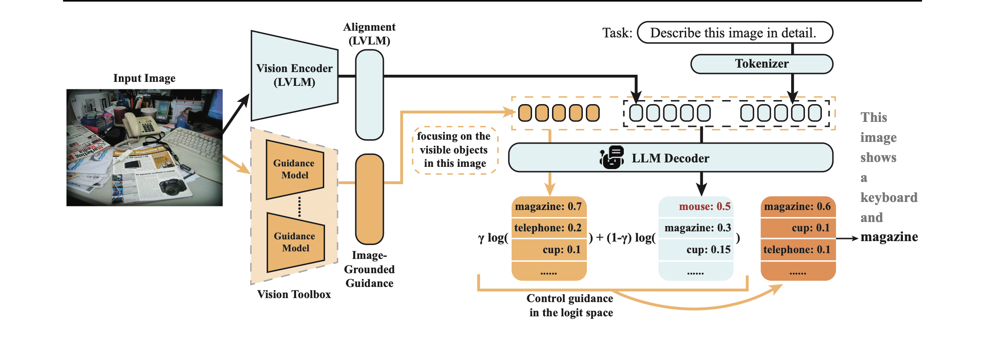

# Hallucination

- [x] ICML 2025: [MARINE](https://arxiv.org/abs/2402.08680)
  - motivation: combat object hallucination
  - contribution: 
    - integrates additional object detection models as toolbox to provide image-grounded guidance prompt
    - Only objects with relatively high probabilities in **both branches** could appear at top when sampling
      - why both? This strikes a balance between a better ability to follow instructions and the increased accuracy and detail in image descriptions
  - 